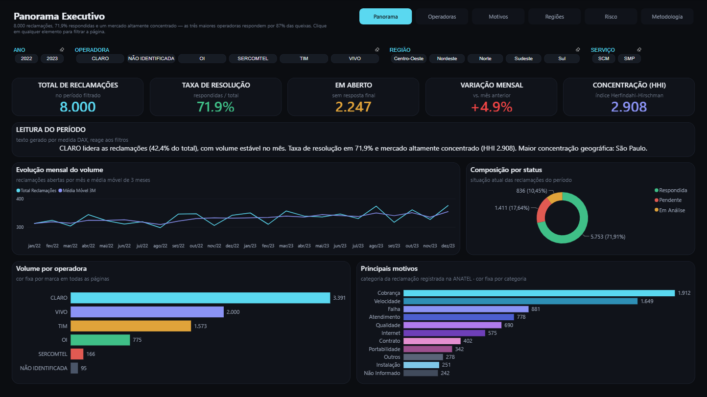
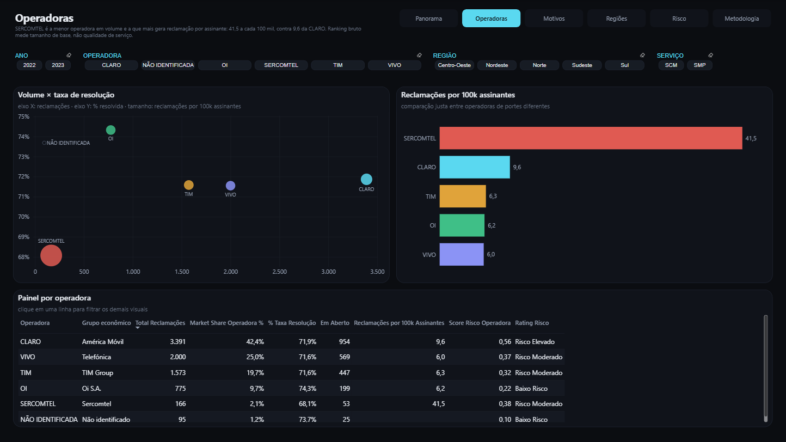
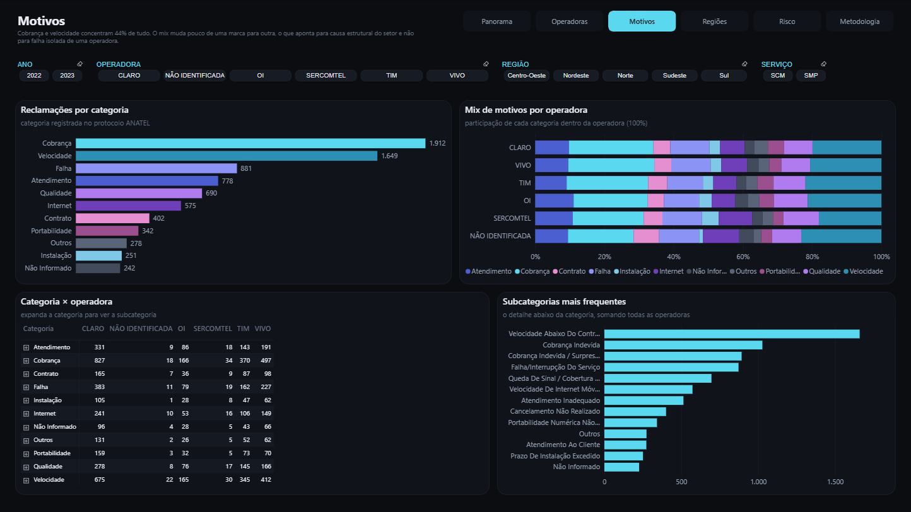
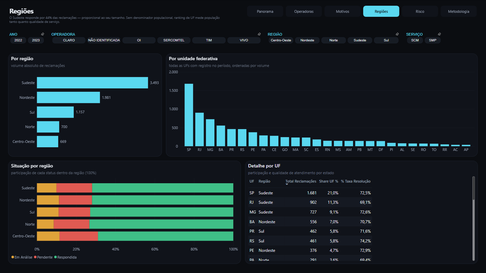
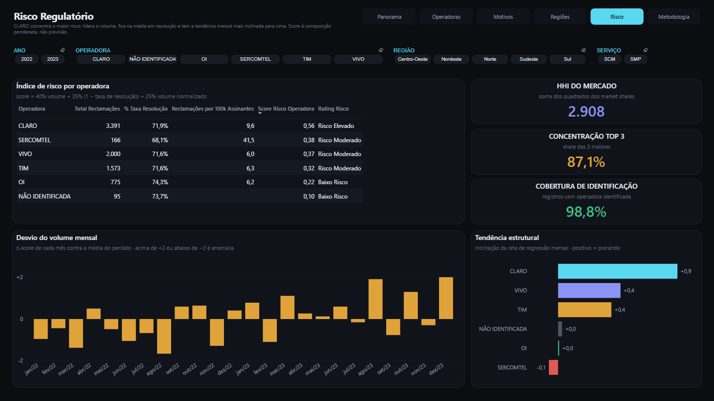
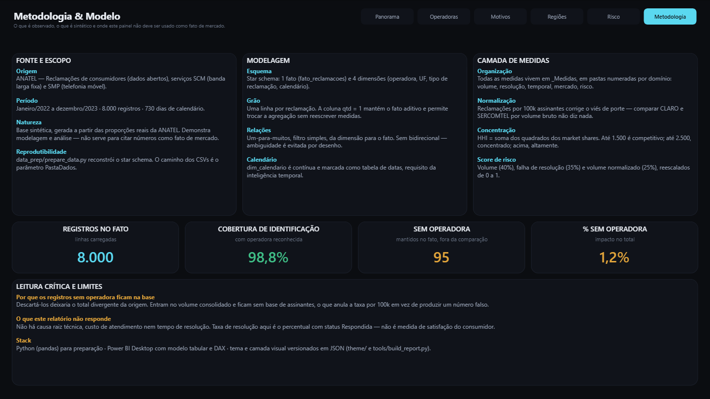

# Telecom Operadoras — Dashboard Power BI

<div align="center">


**Análise regulatória e competitiva de reclamações de consumidores de telecom.**
Star schema modelado em Power BI, 53 medidas DAX e uma camada visual gerada por código.

</div>



---

## As páginas

### Operadoras — a comparação que corrige o viés de porte
SERCOMTEL é a **menor** operadora em volume e a que **mais** gera reclamação por
assinante: 41,5 a cada 100 mil, contra 9,6 da CLARO. Ranking bruto mede tamanho de base,
não qualidade de serviço — por isso as duas visões ficam lado a lado.



### Motivos — causa estrutural, não falha isolada
Cobrança e velocidade concentram 44% de tudo, e o mix muda pouco de uma marca para outra.
A matriz desce até a subcategoria por drill, e o gráfico ao lado dela mostra o mesmo
detalhe somado — "Velocidade abaixo do contratado" é a queixa isolada mais frequente do
período.

As 11 categorias têm cor fixa, de uma família só (azul → violeta → rosa) alternando claro
e escuro a cada passo: onze matizes espalhados pelo círculo cromático viram festa junina,
e onze tons vizinhos da mesma cor se confundem na barra empilhada, onde as fatias se
encostam. "Outros" e "Não Informado" ficam em cinza — são ausência de informação, não
mais um assunto.



### Regiões
Volume por região e por UF, situação por região e o detalhe estado a estado. Sem
denominador populacional, ranking de UF mede população tanto quanto qualidade de serviço —
está dito no próprio subtítulo da página.



### Risco regulatório
Índice composto por operadora, concentração de mercado e detecção de mês fora da curva
por z-score.



### Metodologia & modelo
O que é observado, o que é sintético e onde o painel não deve ser usado.



---

## O que este projeto demonstra

Um relatório de 6 páginas que responde a perguntas de negócio, e o processo por trás dele:
preparação de dados em Python, modelagem dimensional, DAX organizado por domínio e um
relatório cuja camada visual é **gerada por script** e versionada em JSON.

| Pergunta | Página |
|----------|--------|
| Como está o setor neste período e o que mudou? | Panorama Executivo |
| Qual operadora vai pior — em volume e proporcionalmente ao seu tamanho? | Operadoras |
| O que exatamente gera reclamação, e o mix muda entre marcas? | Motivos |
| Onde geograficamente o problema se concentra? | Regiões |
| Quem concentra risco regulatório e houve mês fora da curva? | Risco Regulatório |
| De onde veio o dado, o que ele não responde | Metodologia & Modelo |

---

## Números do período (dados de demonstração)

> Janeiro/2022 a dezembro/2023 · 8.000 reclamações sintéticas geradas a partir das
> proporções publicadas pela ANATEL.

| KPI | Valor |
|-----|-------|
| Total de reclamações | 8.000 |
| Taxa de resolução | 71,9% |
| Em aberto (sem resposta final) | 2.247 |
| Variação mensal (MoM) | +4,9% |
| HHI de concentração | 2.908 — altamente concentrado |
| Concentração Top 3 | 87,1% |
| Cobertura de identificação da prestadora | 98,8% |

**Por operadora**

| Operadora | Reclamações | Market share | Taxa de resolução | Por 100k assinantes | Score de risco |
|-----------|------------:|-------------:|------------------:|--------------------:|---------------|
| CLARO | 3.391 | 42,4% | 71,9% | 9,6 | 0,56 — Risco Elevado |
| VIVO | 2.000 | 25,0% | 71,6% | 6,0 | 0,37 — Risco Moderado |
| TIM | 1.573 | 19,7% | 71,6% | 6,3 | 0,32 — Risco Moderado |
| OI | 775 | 9,7% | 74,3% | 6,2 | 0,22 — Baixo Risco |
| SERCOMTEL | 166 | 2,1% | 68,1% | 41,5 | 0,38 — Risco Moderado |
| NÃO IDENTIFICADA | 95 | 1,2% | 73,7% | — | 0,10 — Baixo Risco |

A leitura que importa está na penúltima coluna: **SERCOMTEL reclama 4x mais por assinante
que a CLARO**. Ranking por volume bruto só mede tamanho de base — por isso o relatório
sempre mostra as duas visões lado a lado.

---

## Camada visual gerada por código

A pasta `Report/definition` dentro do `.pbix` é JSON: uma pasta por página, um arquivo por
visual. [`tools/build_report.py`](tools/build_report.py) reescreve essa camada inteira a
partir de uma especificação declarativa, preservando o modelo de dados intacto.

```bash
python tools/build_report.py                  # reconstrói o relatório no .pbix
python tools/build_report.py src.pbix out.pbix
```

O que isso resolve, na prática:

- **Grid consistente** — margem, calha e altura de painel são calculadas, não arrastadas
  no mouse. Nenhum visual fica 3px fora do alinhamento.
- **Formatação definida uma vez** — tipografia, cor de fundo, borda, grade e eixo saem de
  um único conjunto de tokens no topo do script.
- **Cor amarrada ao valor** — `CLARO` é sempre ciano, `Pendente` é sempre vermelho, em
  todas as páginas, porque a cor é declarada por valor de categoria e não pela ordem em
  que a série aparece no visual.
- **Revisão por diff** — mudar o relatório vira mudança de código, com histórico.

O tema (`theme/fibernet_dark.json`) também é gerado pelo script e embutido no arquivo.

### Escala de arredondamento

Um degrau por nível de superfície, e nada fora da escala — o mesmo em `theme/` e em cada
visual. Antes, cada tipo de elemento tinha o raio que sobrou da vez em que foi escrito
(painel 16, tema 12, segmentação 14, navegação 8) e o conjunto lia como quatro relatórios
colados.

| Token | Valor | Onde |
|---|---:|---|
| `R_CHIP` | 10 px | bloco de filtro |
| `R_CTRL` | 14 px | botão de navegação, segmentação nativa |
| `R_PANEL` | 20 px | painel e cartão |

O raio acompanha o tamanho da superfície: raio único em elementos de tamanhos diferentes
faz o pequeno parecer redondo demais e o grande, duro. O degrau do chip está ancorado nos
10px fixos que o Chiclet Slicer arredonda dentro do próprio código do visual — não há
propriedade para mudar, então a escala parte de um valor real em vez de brigar com ele.

Duas armadilhas do formato, para quem for repetir:

- o raio do botão de navegação **não** é `roundedCornerRadius` (esse é do plano de fundo
  do visual): é `shape.roundEdge`, medido em pontos e declarado com seletor de estado
  (`{"id": "default"}`). Propriedade desconhecida não dá erro — o Power BI ignora em
  silêncio, e os botões saem de canto vivo no meio de uma página toda arredondada;
- **não** tente limpar o `DiagramLayout` reescrevendo a parte com `"nodes": []`. Um
  diagrama sem nó nenhum, num modelo que tem tabela, é estado inválido: o Desktop recusa
  o arquivo inteiro com "esse arquivo está corrompido ou foi criado por uma versão não
  reconhecida" — a mesma mensagem sem pista que o `SecurityBindings` dá.

O mesmo conjunto de tokens vale no
[socioeconomic-powerbi-public](https://github.com/HugoLeonardoNz/socioeconomic-powerbi-public):
paleta e tipografia separam os dois relatórios, o acabamento os une.

---

## Estrutura

```
telecom-powerbi-public/
├── telecom_reclamacoes_anatel.pbix   ← relatório (modelo + camada visual)
├── data_prep/prepare_data.py         ← ETL: limpeza, tipagem, star schema
├── src/
│   ├── generate_data.py              ← gerador de dados sintéticos
│   └── kpis.py                       ← KPIs exportados para outputs/
├── tools/build_report.py             ← gerador da camada visual do .pbix
├── theme/fibernet_dark.json          ← tema (gerado por build_report.py)
├── dax/measures.md                   ← dicionário de medidas
├── docs/DASHBOARD_GUIDE.md           ← guia de leitura das páginas
├── data/
│   ├── raw/                          ← CSVs de origem
│   └── processed/                    ← star schema pronto para carga
└── outputs/                          ← KPIs e figuras da EDA
```

---

## Modelo de dados

```
                     ┌──────────────────────┐
                     │   fato_reclamacoes   │
                     │──────────────────────│
                     │ id_reclamacao (PK)   │
          ┌──────────┤ id_data              ├──────────┐
          │          │ id_operadora         │          │
          │          │ id_uf                │          │
          │          │ id_tipo              │          │
          │          │ Status               │          │
          │          │ Serviço              │          │
          │          │ qtd (sempre 1)       │          │
          │          └──────────┬───────────┘          │
          │                     │                      │
   dim_operadora          dim_calendario            dim_uf
   ──────────────         ──────────────            ──────
   id_operadora (PK)      id_data (PK)              id_uf (PK)
   Operadora              data                      UF
   Porte                  Ano                       Estado
   Grupo econômico        trimestre                 Região
   assinantes_estimados   mes / nome_mes
                          Mês (rótulo)        dim_tipo_reclamacao
                                              ───────────────────
                                              id_tipo (PK)
                                              Categoria
                                              Subcategoria
```

**Grão:** uma linha por reclamação registrada.
**Relações:** um-para-muitos, filtro simples, da dimensão para o fato. Nenhuma
bidirecional — ambiguidade de filtro é evitada por desenho.
**Calendário:** `dim_calendario` é contínua e marcada como tabela de datas, requisito das
funções de inteligência temporal. A **data/hora automática do Power BI está desligada** —
tendo uma dimensão de calendário própria, o recurso só acrescentaria uma tabela de datas
oculta por coluna de data: duas hierarquias concorrentes para a mesma pergunta, modelo
maior e nada em troca. O arquivo tem exatamente as 6 tabelas que a visão de Modelo mostra:
o fato, as 4 dimensões e `_Medidas`.

### Origem dos dados

Portal [dados.anatel.gov.br](https://dados.anatel.gov.br) — Reclamações e denúncias de
consumidores, serviços **SCM** (banda larga fixa) e **SMP** (telefonia móvel). Original em
CSV, ISO-8859-1, separador `;`.

Os dados aqui são **sintéticos**, gerados a partir das proporções reais. Servem para
demonstrar modelagem e análise — não devem ser citados como fato de mercado.

### `assinantes_estimados`

Base estimada por operadora, usada para normalizar volume (ANATEL, dez/2023):

| Operadora | Assinantes |
|-----------|-----------:|
| CLARO | 35.200.000 |
| VIVO | 33.100.000 |
| TIM | 24.800.000 |
| OI | 12.600.000 |
| SERCOMTEL | 400.000 |
| NÃO IDENTIFICADA | *em branco* |

A prestadora não identificada fica com a base em branco de propósito: assim a taxa por
100k retorna vazio em vez de fabricar um número.

---

## Medidas DAX

53 medidas na tabela `_Medidas`, agrupadas em pastas numeradas por domínio. O dicionário
completo com as fórmulas está em [`dax/measures.md`](dax/measures.md).

| Pasta | Do que trata | Exemplos |
|-------|--------------|----------|
| `[01] Volume` | Contagem e recortes básicos | `Total Reclamações`, `Reclamações SCM/SMP` |
| `[02] Resolução` | Status de atendimento | `% Taxa Resolução`, `Em Aberto`, `Qtd Pendentes` |
| `[03] Temporal` | Comparações no tempo | `Var MoM %`, `Var YoY %`, `Média Móvel 3M`, `Tendência Linear Mensal` |
| `[04] Ranking` | Posição e normalização | `Reclamações por 100k Assinantes`, `Ranking Normalizado` |
| `[05] Mercado` | Estrutura competitiva | `HHI`, `Classificação HHI`, `Concentração Top 3 %` |
| `[06] Risco & Alertas` | Composição de risco e anomalia | `Score Risco Operadora`, `Z-Score Volume Mensal`, `Flag Anomalia` |
| `[07] Categoria & Geografia` | Recortes por motivo e UF | `Share Categoria %`, `Share UF %`, `Rank UF` |
| `[08] Narrativa` | Texto que lê os números | `Insight Executivo`, `Título Dinâmico` |
| `[09] Auxiliares` | Cores para formatação condicional | `Cor Operadora`, `Cor Var MoM`, `Cor Score Risco` |
| `[11] Qualidade do Dado` | Confiabilidade da base | `Cobertura de Identificação`, `% Não Identificado` |

Três medidas merecem destaque:

**`Reclamações por 100k Assinantes`** — o número que torna a comparação honesta.
Sem ele, "quem tem mais reclamação" é só "quem tem mais cliente".

**`Score Risco Operadora`** — composição ponderada de volume (40%), falha de resolução
(35%) e volume normalizado (25%), reescalada de 0 a 1. Os pesos são uma escolha de
modelagem, documentada na própria página de risco.

**`Z-Score Volume Mensal`** — desvio padronizado do mês contra a média do período. Retorna
vazio quando o contexto não tem um único mês, para não devolver um número sem sentido se
a medida for arrastada para outro visual.

---

## Como reproduzir

```bash
pip install -r requirements.txt

python src/generate_data.py       # gera os CSVs sintéticos em data/raw
python data_prep/prepare_data.py  # constrói o star schema em data/processed
python src/kpis.py                # (opcional) exporta KPIs para outputs/
```

Depois, abrir `telecom_reclamacoes_anatel.pbix` no Power BI Desktop.

O caminho dos CSVs é o parâmetro **`PastaDados`** do Power Query. Ao clonar o repositório
em outra máquina: *Transformar dados → Gerenciar parâmetros → PastaDados* e apontar para
a pasta `data/processed` local. Sem isso a atualização falha — o caminho não fica
embutido nas consultas.

Para usar dados reais, baixar os CSVs do portal ANATEL, salvar em `data/raw/` e rodar
`prepare_data.py`.

---

## Decisões técnicas

- **`SUM(qtd)` em vez de `COUNTROWS`** — mantém o fato aditivo e permite trocar a
  agregação no futuro sem reescrever as medidas dependentes.
- **Star schema com chaves inteiras** — relacionamento mais rápido que chave de texto.
- **Registros sem prestadora ficam no fato** — descartá-los deixaria o total divergente da
  origem. Entram no volume consolidado e ficam de fora da comparação competitiva, com a
  cobertura de identificação exposta como KPI.
- **Colunas com nome de negócio** — `Operadora`, `Grupo econômico`, `UF`, `Categoria`.
  O cabeçalho de uma tabela é interface, não nome de coluna do banco.
- **Nenhum visual customizado de marketplace** — tudo em visual nativo. O arquivo caiu de
  2,7 MB para 278 KB, abre mais rápido e não depende de visual de terceiro.
- **Camada visual em código** — `tools/build_report.py`, pelos motivos da seção acima.

---

## Stack

`Python 3.x` · `pandas` · `NumPy` · `Power BI Desktop` · `DAX` · `Power Query (M)` ·
`PBIR` (formato JSON do relatório)

---

## Autor

**Hugo Leonardo**
Analista de Dados Pleno — SQL · Python · Power BI
Speed Fibra · Santa Luzia, MG

[](https://www.linkedin.com/in/hugo-leonardo-data-analyst/)
[](https://github.com/HugoLeonardoNz)
